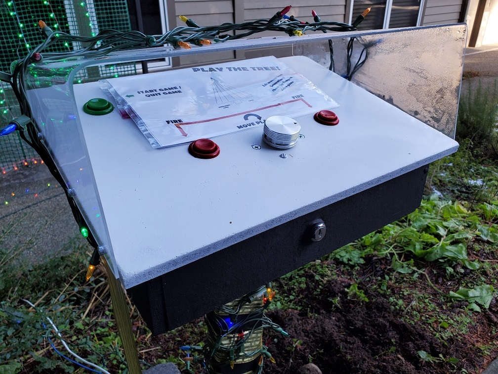
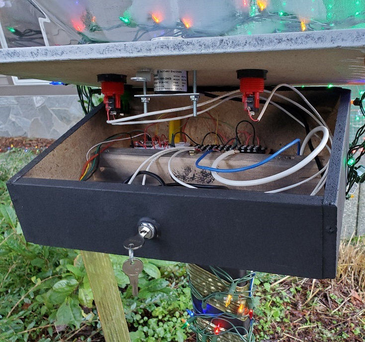

# Tempest in a Tree

I like to do interactive projects and the holidays are a great excuse.  Holidays also make for a firm deadline - which I need.  A few years ago I did a project using Kinect for Windows to control lights and wanted to something again this year.  After seeing [this video](https://www.youtube.com/watch?v=5wGiDuXApr8) by Bob at "I Like To Make Stuff" it was clear I needed to make Tempest in a Tree.
## Hardware
Hardware is pretty straightforward.  A [Particle Photon](https://store.particle.io/collections/gen-2/products/photon) controls everything.  The LEDs are standard [WS2811 strips](https://www.amazon.com/dp/B01NCAG8KV/ref=cm_sw_em_r_mt_dp_Q7n5FbW4WQNWF).  The rotary encoder is [some random one](https://www.amazon.com/dp/B07MX5DWF3/ref=cm_sw_em_r_mt_dp_y9n5Fb4CPBQW0?_encoding=UTF8&psc=1) I found at Amazon. And the buttons are arcade buttons.

The Photon and controls are all mounted in a control box I built.  I don't really have plans for it - just made it on the fly.  There is a piano hinge on the back and a lock on the front.  I can't say it's secure at all - just to keep people from unintentionally opening it up.  The cover is acrylic I bent into shape with a heat gun.  The hope is to reduce the amount of rain that gets into things.  Nothing here is really waterproof so I'm doing what I can.  I used [this technique](https://www.youtube.com/watch?v=PTNWg91Z8oo) to drill the holes for the mounting screws.

The LEDs are mounted on green chicken fence I got at the hardware store.  That's held up on some mounts I built.  There are cinder blocks at the base to, hopefully, keep things from falling down.  Everything is pretty wind-transparent so there shouldn't be much force from nature to knock things over.

## Software
The game engine is written from scratch.  There is an LED animation library included that I used for a different lighting project.  I also use the NeoPixel library.  In order to read the rotary encoder consistently I needed to tweak the neopixel library to re-enable interrupts after shifting out each LED.  Otherwise we'd miss signals from the rotary encoder spinning.  The Particle OS was also causing the LEDs to glitch during updates.  This isn't a big deal during development but for the final deployment I added a call to [SYSTEM_MODE(MANUAL)](https://docs.particle.io/reference/device-os/firmware/photon/#manual-mode) to disable all the Particle stuff.  There is probably a cleaner way to do this.

There are some unit tests that I mostly used during development to make sure I didn't have off-by-one errors in the LED stuff.  It's pretty minimal.

The code is a bit of a mess - inconsistent naming conventions, inconcistent use of #define VS const, ordering of stuff, etc.  Deadlines and all :-)

## Cut features
Because you can't change the date of Christmas, I needed to cut some features.  Maybe next year
- Score, level, and remaining life display on the control panel
- More festive idle animations that don't bug the neighbors
- A better player died animation (currently it's one I hacked in during testing that was good enough)
- Sound - This would be so much better with sound
- Highlight the lane where your shot will go.  This would actually only take a few minutes to add but you just have to stop at a certain point.
- Enemies that change lanes as they descend.  Again, another 20 minute feature - but stuff like this are what keeps you from making a deadline
- More play testing - it was just me and my daughters
- Use Vinyl-cut lettering for the directions.  COVID took away my access to a bunch of cool tools (laser cutters, vinyl cutter, Circut, etc.) so these things needed to wait

